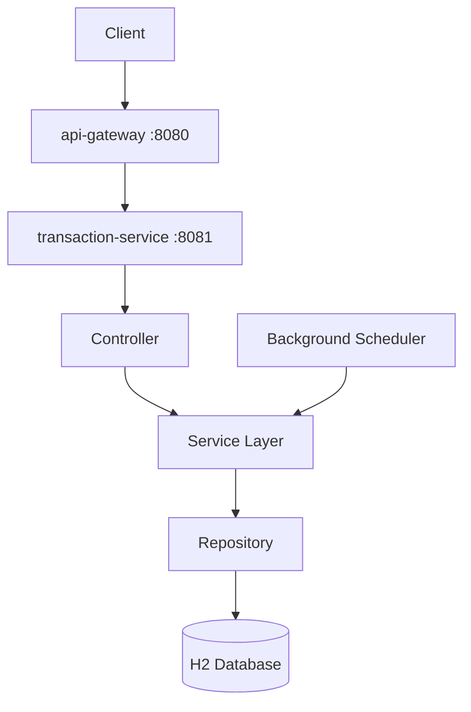

# Transaction Processing System

Idempotent background transaction processing service built with **Java 21**, **Spring Boot 3.3**, and a simple layered architecture suitable for technical interviews.

## Project Overview

This system ingests financial transactions via REST APIs, processes them asynchronously in the background, and guarantees **idempotency** and **duplicate detection** using `transactionId` + `requestId`. It supports out-of-order events through sequence-based processing, transient failure retries, observability, and processing summaries.

## Architecture Diagram



```
Client
  │
  ▼
api-gateway (Spring Cloud Gateway)
  │  correlationId / traceId / logging
  ▼
transaction-service
  │
  ├── Controller → Service → Repository → H2
  └── Scheduler (background processing)
```

## Technology Stack

| Layer | Technology |
|-------|------------|
| Runtime | Java 21 |
| Framework | Spring Boot 3.3.5 |
| API | Spring Web, Bean Validation |
| Persistence | Spring Data JPA, H2 |
| Gateway | Spring Cloud Gateway |
| Observability | Actuator, Micrometer, Prometheus, Logback JSON |
| Build | Maven |
| Testing | JUnit 5, Mockito, Spring Boot Test |

## Design Decisions

1. **Layered architecture** — Controller → Service → Repository keeps the solution easy to explain without DDD/CQRS overhead.
2. **Idempotency store** — `processed_requests` table with unique `(transactionId, requestId)` prevents double balance updates.
3. **Sequence-based ordering (Option A)** — Per `accountId`, sequence `N` waits until `N-1` is `PROCESSED`; otherwise status is `PENDING`.
4. **Retry only transient failures** — `RetryableException` with max 3 attempts; permanent errors become `FAILED`.
5. **Structured JSON logging** — Logstash encoder + MDC for correlation across gateway and service.
6. **Maven multi-module** — `common` shared library, `transaction-service` core API, `api-gateway` edge routing.

## Project Structure

```
transaction-processing-system/
├── api-gateway/
├── transaction-service/
├── common/
├── pom.xml
└── README.md
```

## API Documentation

| Method | Path | Description |
|--------|------|-------------|
| POST | `/transactions` | Submit a transaction |
| GET | `/transactions/{id}` | Get transaction by internal ID |
| GET | `/transactions` | List all transactions |
| GET | `/transactions/summary` | Processing summary |
| POST | `/transactions/process` | Trigger background processing |
| POST | `/transactions/retry` | Retry failed / retry-pending |
| GET | `/actuator/health` | Health check |

**Via gateway:** prefix routes with `/api` (e.g. `POST /api/transactions`).

## Sample Requests

### Submit transaction
```http
POST /api/transactions
Content-Type: application/json
X-Correlation-Id: demo-correlation-1

{
  "transactionId": "TXN-DEMO-001",
  "requestId": "REQ-DEMO-001",
  "sequenceNumber": 1,
  "accountId": "ACC-1001",
  "amount": 50.00,
  "type": "CREDIT"
}
```

### Trigger processing
```http
POST /api/transactions/process
```

### Processing summary
```http
GET /api/transactions/summary
```

## Sample Responses

### Submit (202 Accepted)
```json
{
  "timestamp": "2026-06-30T10:00:00Z",
  "correlationId": "demo-correlation-1",
  "data": {
    "id": 1,
    "transactionId": "TXN-DEMO-001",
    "requestId": "REQ-DEMO-001",
    "sequenceNumber": 1,
    "accountId": "ACC-1001",
    "amount": 50.00,
    "type": "CREDIT",
    "status": "RECEIVED",
    "retryCount": 0
  }
}
```

### Validation error (400)
```json
{
  "timestamp": "2026-06-30T10:00:00Z",
  "status": 400,
  "error": "Bad Request",
  "errorCode": "VALIDATION_ERROR",
  "message": "Request validation failed",
  "fieldErrors": [
    { "field": "accountId", "message": "accountId must match ACC-####" }
  ]
}
```

## H2 Console Access

When running `transaction-service` directly:

- URL: http://localhost:8081/h2-console
- JDBC URL: `jdbc:h2:mem:transactiondb`
- Username: `sa`
- Password: *(empty)*

## Running Instructions

### Prerequisites
- JDK 21
- Maven 3.9+

### Build all modules
```bash
mvn clean install
```

### Run transaction-service
```bash
cd transaction-service
mvn spring-boot:run
```

### Run api-gateway (separate terminal)
```bash
cd api-gateway
mvn spring-boot:run
```

Gateway: http://localhost:8080  
Service: http://localhost:8081

## Testing Instructions

Run all module tests with the helper script:

```bash
./scripts/run-tests.sh
```

Or with Maven directly:

```bash
mvn test
```

For a clean test run (recommended):

```bash
./scripts/run-tests.sh
# equivalent to: mvn clean test
```

The script auto-selects Java 21 on macOS when available. Pass extra Maven args through, e.g. `./scripts/run-tests.sh -pl transaction-service`.

### Test results dashboard

After tests complete, `./scripts/run-tests.sh` automatically:

1. Prints a **terminal dashboard** with unit/integration summary and every scenario (PASS/FAIL + time)
2. Generates **`target/test-dashboard.html`** (opens in browser on macOS)
3. Links to **JaCoCo coverage** when available

Regenerate the dashboard without re-running tests:

```bash
python3 scripts/generate-test-dashboard.py
```

JaCoCo report: `transaction-service/target/site/jacoco/index.html`

Test categories: controller, service, repository, validation, retry, duplicate, idempotency, summary, **integration** (end-to-end idempotency, failures, out-of-order, retry API).

## Logging Explanation

Structured JSON logs include: `timestamp`, `level`, `applicationName`, `serviceName`, `thread`, `logger`, `traceId`, `correlationId`, `transactionId`, `requestId`, and `message`.

Key events logged:
- Request received / completed
- Background processing started / completed
- Duplicate detected
- Retry started / completed
- Validation failures
- Processing summary metrics

Sensitive account data is not logged beyond identifiers required for tracing.

## Gateway Configuration

- Routes `/api/transactions/**` → `transaction-service` (`/transactions/**`)
- Forwards `/actuator/**` to the service
- Global filters: correlation ID, trace ID, request/response logging, timing
- Global error handler returns consistent JSON errors

## Actuator Endpoints

Exposed on both modules:
- `/actuator/health`
- `/actuator/info`
- `/actuator/metrics`
- `/actuator/env`
- `/actuator/loggers`
- `/actuator/prometheus`

Custom `TransactionHealthIndicator` reports backlog and failed transaction counts.

## Idempotency Strategy

1. On ingest, check `processed_requests` for `(transactionId, requestId)`.
2. If already processed → return `DUPLICATE` without balance change.
3. On successful processing, persist idempotency record before completing.
4. Unique DB constraints on both `transactions` and `processed_requests` enforce safety.

## Retry Strategy

- Transient failures raise `RetryableException` (sample: amount `999.99`).
- Max **3** retry attempts.
- Status transitions: `PROCESSING` → `RETRY_PENDING` → re-process.
- Permanent failures (e.g. insufficient funds) → `FAILED` (no retry).

## Out-of-Order Strategy (Option A)

Per `accountId`:
1. Sequence `1` processes immediately when eligible.
2. Sequence `N>1` requires sequence `N-1` in `PROCESSED` state.
3. Otherwise transaction is marked `PENDING`.
4. When a sequence completes, pending successors are activated automatically.

## Sample Data (L1 / L2)

`data.sql` seeds:
- **L1**: Basic credit/debit sequences on `ACC-1001`, `ACC-1002`
- **L2**: Out-of-order events on `ACC-2001`, retry case (`999.99`), insufficient funds failure
- Duplicate scenarios are validated via API/tests (DB unique constraint)

## Assumptions

- Sequence ordering is scoped per `accountId`.
- `transactionId` + `requestId` uniquely identifies an idempotent operation.
- H2 in-memory DB is sufficient for the assessment.
- No authentication/authorization required.
- Background processing runs on a scheduler (30s) and via manual `POST /transactions/process`.
- Amount `999.99` simulates transient failures for demo/retry testing.

## Known Limitations

- Single-node deployment; no distributed locking.
- In-memory H2 does not survive restarts.
- Gateway routes to `localhost:8081` (not service discovery).
- No pagination on `GET /transactions`.
- Balance updates are simplified (no ledger/history table).

## Production Improvements

- PostgreSQL with migrations (Flyway/Liquibase)
- Distributed idempotency (Redis or DB with TTL)
- Kubernetes + health probes
- API authentication (OAuth2/JWT)
- Dead-letter queue for permanent failures
- OpenTelemetry tracing
- Rate limiting at gateway
- Pagination, filtering, and audit trail

## Phase 1 — Requirements Analysis

### Functional Requirements
- Transaction ingestion, validation, background processing
- Idempotency & duplicate detection (`transactionId` + `requestId`)
- Out-of-order handling (sequence-based)
- Retry for transient failures (max 3)
- Status lifecycle: RECEIVED, PROCESSING, PROCESSED, FAILED, RETRY_PENDING, DUPLICATE, PENDING
- Processing summary & status tracking
- REST APIs as specified
- Sample data for L1/L2 scenarios

### Non-Functional Requirements
- Java 21, Spring Boot 3.x, Maven multi-module
- Structured JSON logging with correlation/trace IDs
- Actuator + Prometheus metrics
- 80% test coverage target
- Clean layered architecture, maintainable code

### Assumptions
Listed in [Assumptions](#assumptions) above.

### Optional / Not Implemented
- Docker, Kubernetes, Kafka, Redis, OAuth/JWT (explicitly excluded)
- CQRS, Event Sourcing, DDD

### Ambiguities Resolved
- Duplicate seed row removed from `data.sql` due to unique constraint; duplicates tested via API.
- Sequence scope assumed per `accountId`.
- Transient failure simulated via amount `999.99`.
